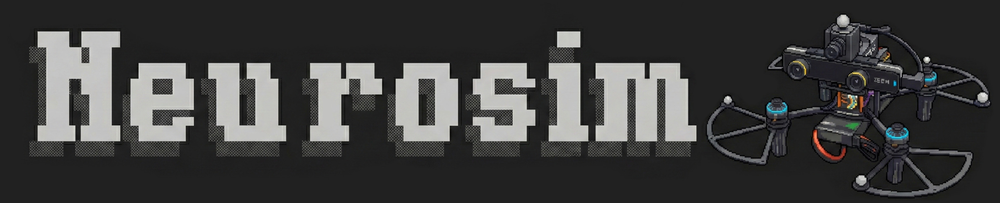

[](assets/neurosim_banner.jpg)

# Neurosim

> Blazing fast multirotor simulator with event camera support. Pythonic and real-time.

<div align="center">

[](https://www.python.org/downloads/)
[](https://developer.nvidia.com/cuda-toolkit)
[](LICENSE)
[](https://arxiv.org/abs/2602.15018)

[Richeek Das](https://www.seas.upenn.edu/~richeek/), [Pratik Chaudhari](https://pratikac.github.io/)

*GRASP Laboratory, University of Pennsylvania*

[[📜 Paper](https://arxiv.org/abs/2602.15018)] • [[📖 BibTeX](#citation)]

</div>

**Quick Start:** If you only need a fast CUDA event simulator, we've made it standalone. Learn how to use our optimized event simulator at [grasp-lyrl/neurosim_cu_esim](https://github.com/grasp-lyrl/neurosim_cu_esim).

<div align="center">
  
</div>


## 📰 News

- [ ] Hardware-in-the-loop (HIL) support for real robot testing
- [ ] 📚 Detailed documentation and tutorials
- `04/16/26`: Added dynamic obstacles thrown at the agent.
- `03/30/26`: Reinforcement Learning (RL) support added.
- `02/16/26`: Neurosim paper released on arXiv ([2602.15018](https://arxiv.org/abs/2602.15018)).
- `02/15/26`: [neurosim_cu_esim](https://github.com/grasp-lyrl/neurosim_cu_esim) now standalone for faster event simulation.
- `02/06/26`: Initial release of Neurosim!


## 📋 Table of Contents

- [Applications](#applications)
- [Installation](#installation)
  - [Option 1: Docker (Recommended)](#option-1-docker-recommended)
  - [Option 2: Conda](#option-2-conda)
- [Basic Usage](#basic-usage)
- [Citation](#citation)
- [Issues](#issues)


## Applications

Neurosim enables **real-time closed-loop control** (`src/neurosim/sims/asynchronous_simulator`, `src/neurosim/cortex/`), **online training of multi-modal perception models** (`applications/f3_training/`), and **event-based reinforcement learning with NeurosimRL** (`applications/rl/`). Detailed docs to run each of them are coming soon!

<div align="center">
  
  <p><em>Rollout with a trained policy to stabilize a "thrown" quad (without crashing into things)</em></p>
</div>


### RL Quick Start (reproducing the cool stuff above)

Download the pretrained checkpoint folder from [here](https://drive.google.com/drive/folders/1I0XvLGo0jb_W-zJGP8SGHMvGu2ucsXrj?usp=sharing) and place them inside `applications/rl/example_ckpt/hover_sb3_combined_experiment`

Then (once you have [Neurosim installed](#installation)) you can rollout the trained policy with:

```bash
python applications/rl/run_policy.py \
  --checkpoint applications/rl/example_ckpt/hover_sb3_combined_experiment/best_model.zip \
  --rollout-config applications/rl/configs/hover_sb3_combined_rollout.yaml \
  --episodes 10 \
  --visualize
```


## Installation

### Option 1: Docker (Recommended)

Docker provides a consistent environment with all dependencies pre-configured, including CUDA and ZMQ libraries. Two image variants are available:

- `ros` (default): includes ROS2 Humble and ROS development tooling
- `noros`: excludes ROS2 for a lighter image when ROS integration is not needed

#### Prerequisites
- Docker with NVIDIA GPU support ([nvidia-docker](https://github.com/NVIDIA/nvidia-docker))
- NVIDIA drivers installed on host (nvcc 12.9+)

#### Pull Prebuilt Images (Recommended)

```bash
# Clone the repository
git clone https://github.com/grasp-lyrl/neurosim.git
cd neurosim

# Pull ROS-enabled image
docker pull richeek01/neurosim:ros

# OR Pull image without ROS2
docker pull richeek01/neurosim:noros

# Tag pulled images so existing run script works unchanged
docker tag richeek01/neurosim:ros neurosim:ros
docker tag richeek01/neurosim:noros neurosim:noros
docker tag richeek01/neurosim:latest neurosim:latest
```

#### Build Locally (Optional)

```bash
# Build ROS-enabled image (default, takes ~15-20 minutes)
bash docker/build.sh ros

# Build image without ROS2
bash docker/build.sh noros
```

#### Run the Container

```bash
# Launch ROS-enabled container (default)
bash docker/run.sh ros

# Launch container without ROS2
bash docker/run.sh noros
```

This will:
- Mount the current directory to `/home/${USER}/neurosim` inside the container
- Enable GPU access with all CUDA capabilities
- Forward X11 display for GUI applications
- Set up shared networking and IPC

#### Inside the Container

```bash
# Navigate to the workspace
cd neurosim

# neurosim environment should be activated by default. If not, run:
conda activate neurosim

# Download example scenes
python -m habitat_sim.utils.datasets_download --uids habitat_test_scenes --data-path data/

# Run the simulator
python test_sim.py --settings configs/skokloster-castle-settings.yaml --display --world_rate 750
```

---

### Option 2: Conda

#### System Requirements

- **OS:** Ubuntu 22.04/24.04 (tested)
- **Compiler:** GCC 11.4.0+
- **CMake:** 3.14.0+
- **CUDA:** 12.2 / 12.4 / 12.6 / 12.9 / 13.0 (tested)
- **Python:** 3.10

#### Install System Dependencies

```bash
sudo apt-get update
sudo apt-get install -y --no-install-recommends \
    libjpeg-dev libglm-dev libgl1-mesa-glx libegl1-mesa-dev \
    mesa-utils xorg-dev freeglut3-dev
```

#### Install Neurosim

```bash
# Create conda environment
conda create -n neurosim python=3.10 cmake=3.14.0 pip==25.1.1 -y
conda activate neurosim

# Install neurosim in editable mode
pip install -e . -v
```

---

## Basic Usage

### Download Example Data

```bash
python -m habitat_sim.utils.datasets_download --uids habitat_test_scenes --data-path data/
```

### Run the Simulator

```bash
python test_sim.py --settings configs/skokloster-castle-settings.yaml --display --world_rate 750
```

## Citation

If you use this code in your research, please cite:

```bibtex
@misc{das2026neurosim,
      title={Neurosim: A Fast Simulator for Neuromorphic Robot Perception}, 
      author={Richeek Das and Pratik Chaudhari},
      year={2026},
      eprint={2602.15018},
      archivePrefix={arXiv},
      primaryClass={cs.RO},
      url={https://arxiv.org/abs/2602.15018}, 
}
```

## Issues

Please report any bugs or feature requests on GitHub issues. Pull requests are very welcome!

### Compilation Issues

- If compilation crashes due to high memory usage or CPU load, manually set `self.parallel=4` inside `setup.py` of habitat-sim to limit parallel jobs.

- `pip==25.3` breaks installation due to changes in the build isolation process. Use `pip==25.1.1` as specified.


## License

Apache 2.0 License - see the [LICENSE](LICENSE) file for details.

## Acknowledgements

This project is enabled by the following amazing open-source projects: [Habitat-Sim](https://github.com/facebookresearch/habitat-sim), [ZeroMQ](https://zeromq.org), [RotorPy](https://github.com/spencerfolk/rotorpy)

Banner credits: [@ongdexter](https://dexterong.com/), Gemini 3
